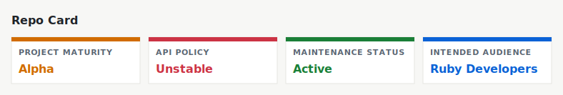

# Watchly



Watchly is a lightweight, dependency-free, polling-based file watcher for Ruby.
It watches one or more glob patterns and reports file changes in a simple,
predictable way.

Watchly is designed around *batch semantics*: when files change, a single
callback is triggered with a complete description of what changed.

An official command-line interface is available via the
[watchly-cli][watchly-cli] gem.

---

## Installation

```bash
gem install watchly
```

Or in your Gemfile:

```ruby
gem 'watchly'
```

---

## Usage

### Initialize a watcher

```ruby
require 'watchly'

# with the default interval (1 second)
watcher = Watchly::Watcher.new '**/*'

# with a different interval
watcher = Watchly::Watcher.new '**/*', interval: 2.0

# with multiple glob patterns
watcher = Watchly::Watcher.new 'spec/**/*.rb', 'lib/*.*'
```

---

### Watch for changes

When changes are detected, Watchly yields a Changeset object describing
all filesystem changes since the last poll.

```ruby
watcher.on_change do |changes|
  changes.each do |type, path|
    puts "#{type}: #{path}"
  end
end
```

This will output events such as:

```
added: spec/new_spec.rb
modified: lib/watchly.rb
removed: tmp/debug.log
```

---

### Accessing specific change types

The `changes` object exposes separate collections for each type of change:

- `changes.added`
- `changes.removed`
- `changes.modified`

Example:

```ruby
watcher.on_change do |changes|
  puts "Added files:"
  changes.added.each { |path| puts "  + #{path}" }

  puts "Modified files:"
  changes.modified.each { |path| puts "  * #{path}" }

  puts "Removed files:"
  changes.removed.each { |path| puts "  - #{path}" }
end
```

---

### Working with actionable files

In many cases, you only want to work with files that currently exist.

For this purpose, `changes.files` provides a convenient, pre-filtered list of
**actionable files**:

- Includes: added and modified files
- Excludes: removed files

```ruby
watcher.on_change do |changes|
  next if changes.empty?

  puts "Processing files:"
  changes.files.each do |path|
    puts "  - #{path}"
  end
end
```

A changeset that only contains removed files is considered empty.
This prevents unnecessary processing when files are deleted.

---

### Checking for changes

You can test whether a changeset contains any actionable files:

```ruby
watcher.on_change do |changes|
  if changes.any?
    puts "Files changed:"
    changes.files.each { |path| puts "  - #{path}" }
  else
    puts "Files were removed:"
    changes.removed.each { |path| puts "  - #{path}" }
  end
end
```

Or explicitly:

```ruby
changes.empty? # => true if no added or modified files
changes.any?   # => true if at least one actionable file exists
```

The on_change callback is triggered for any filesystem change, including deletions.
The `any?` and `empty?` helpers reflect whether there are actionable files
(added or modified).

---

### Stopping the watcher

```ruby
# Mainly useful for tests, but can be called from another thread
watcher.stop
```

---

## Contributing / Support

If you experience any issue, have a question, or wish to contribute,
feel free to [open an issue][issues].

[issues]: https://github.com/dannyben/watchly/issues
[watchly-cli]: https://github.com/dannyben/watchly-cli
